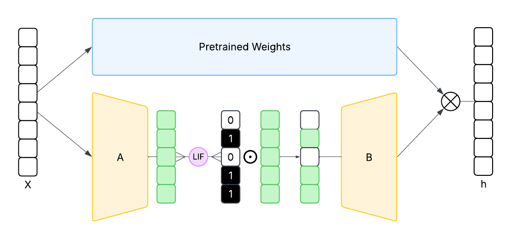

# SpikeLoRA: Learnable Activation Sparsity for Low-Rank Adaptation using Spiking Neural Networks



## Introduction

[SpikeLoRA](https://huggingface.co/papers/2402.09353) is a novel fine-tuning method that builds on LoRA by introducing spiking neuron-based sparsity. While standard LoRA focuses on parameter-level efficiency by injecting small trainable matrices into frozen pretrained weights, SpikeLoRA directly controls activations in the low-rank space using leaky integrate-and-fire (LIF) neurons. The LIF neurons gate the activations of the A-matrix in LoRA, sparsifying them while preserving learned information. This design enhances training efficiency and stability, mitigates overfitting in high-rank scenarios, and is compatible with neuromorphic hardware, all without adding inference overhead.

## Quick start

```python
import torch
from peft import LoraConfig, get_peft_model
from transformers import AutoTokenizer, AutoModelForCausalLM, Trainer
from datasets import load_dataset

model = AutoModelForCausalLM.from_pretrained("huggyllama/llama-7b", device_map="cuda")
tokenizer = AutoTokenizer.from_pretrained("huggyllama/llama-7b")
dataset = load_dataset("timdettmers/openassistant-guanaco", split="train")
lora_config = LoraConfig(
    use_spikelora=True
    spikelora_v_threshold=0.1
)
peft_model = get_peft_model(model, lora_config)
trainer = Trainer(
    model=peft_model,
    train_dataset=dataset,
    dataset_text_field="text",
    max_seq_length=2048,
    tokenizer=tokenizer,
)
trainer.train()
peft_model.save_pretrained("spikelora-llama-7b")
```

Running the finetuning script is also simple:

```bash
python examples/spikelora_finetuning/spikelora_finetuning.py \
    --base_model meta-llama/Meta-Llama-3-8B \
    --data_path timdettmers/openassistant-guanaco \
    --use_spikelora \
    --spikelora_v_threshold 0.1 \
```

SpikeLoRA also supports quantization:

```bash
python examples/spikelora_finetuning/spikelora_finetuning.py \
    --base_model meta-llama/Meta-Llama-3-8B \
    --data_path timdettmers/openassistant-guanaco \
    --use_spikelora \
    --spikelora_v_threshold 0.1 \
    --quantize
```

Custom target layers can be defined as with LoRA:

```bash
python examples/spikelora_finetuning/spikelora_finetuning.py \
    --lora_target_modules "q_proj,k_proj,v_proj,o_proj"
```

### Full example

```bash
python spikelora_finetuning.py \
    --base_model "PATH_TO_MODEL" \
    --data_path "PATH_TO_DATASET" \
    --output_dir "PATH_TO_OUTPUT_DIR" \
    --batch_size 1 \
    --num_epochs 3 \
    --learning_rate 3e-4 \
    --cutoff_len 512 \
    --val_set_size 500 \
    --use_spikelora \
    --spikelora_v_threshold 0.1 \
    --quantize \
    --eval_step 10 \
    --save_step 100 \
    --device "cuda:0" \
    --lora_r 16 \
    --lora_alpha 32 \
    --lora_dropout 0.05 \
    --lora_target_modules "q_proj,k_proj,v_proj,o_proj" \
    --hub_model_id "YOUR_HF_REPO" \
    --push_to_hub
```

## Using SpikeLoRA models

```python
from transformers import AutoModel
model = AutoModel.from_pretrained("ShirinYamani/huggyllama-llama-7b-spikelora")
```

## SpikeLoRA vs LoRA

SpikeLoRA extends LoRA by introducing learned sparsity at the activation level using LIF neurons, offering a trainable and dynamic approach to low-rank adaptation:

1. **Activation-level sparsity:** Each LoRA module is coupled with an LIF neuron that gates activations in the low-rank space. The binary mask produced by the neuron selectively preserves informative features while suppressing less relevant ones, achieving up to **97.24% sparsity** in practice with minimal impact on performance.

2. **Efficiency and regularisation:** While the added LIF neuron slightly increases training time (e.g., 19.42 → 21.68 min on CoLA), SpikeLoRA indirectly mitigates overfitting by reducing extreme gradient updates, particularly in higher-rank configurations. Sparsity is controllable via the neuron threshold $V_\theta$, balancing performance and model compression.

3. **Robust performance:** Across experiments on CoLA, GLUE, and SpikeGPT, SpikeLoRA achieves comparable or slightly improved classification metrics relative to LoRA, even in low-resource settings. It maintains performance while introducing sparsity, providing a more robust fine-tuning mechanism.

4. **Flexibility:** SpikeLoRA can be combined with other LoRA variations (e.g., AdaLoRA) without altering their core mechanisms. This allows for efficient cooperability and potential integration with neuromorphic or spiking-inspired architectures.

5. **Hyperparameter sensitivity:**

   * **Rank:** Higher ranks benefit more from SpikeLoRA’s sparsity, which reduces overfitting compared to LoRA.
   * **Learning rate:** Sparsity in the low-rank space is proportional to learning rate, with moderate rates balancing sparsity and accuracy.
   * **Threshold $V_\theta$:** Increasing $V_\theta$ increases sparsity but can induce model collapse if set too high ($V_\theta \gtrapprox 1.0$).

In summary, SpikeLoRA provides a **parameter-efficient, sparse, and robust alternative** to standard LoRA, particularly suited for low-resource datasets or high-rank settings where LoRA is prone to overfitting. Its spiking-inspired gating offers a promising direction for integrating SNN mechanics into modern LLM fine-tuning pipelines.

## Citation

Currently in review, citation will be added once available.